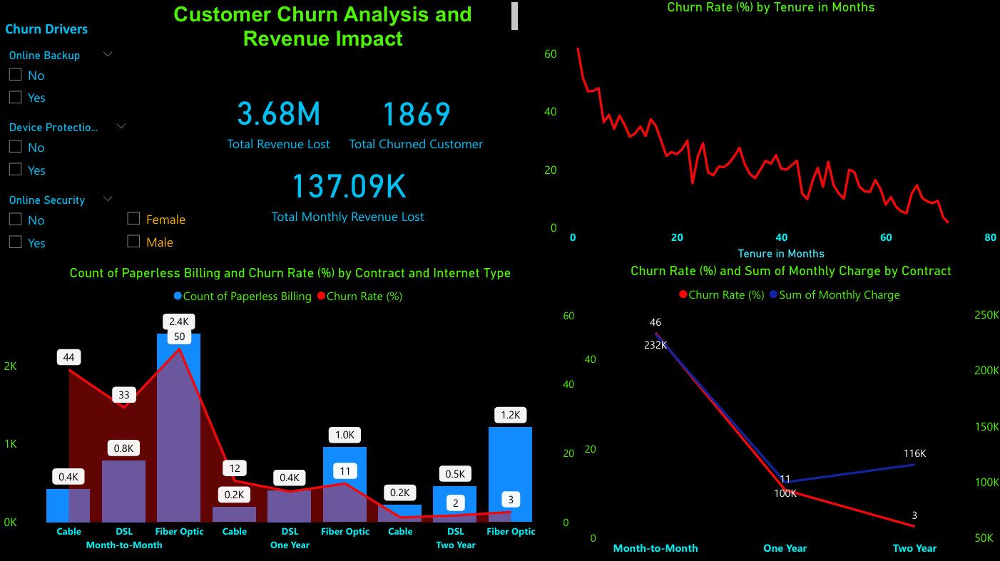

# 📊 Telecom Customer Churn Prediction – End-to-End Analytics & Machine Learning

## 🧠 Project Overview

Customer churn is one of the biggest profitability challenges in the telecom industry. This project combines manual Exploratory Data Analysis (EDA) with a Gradient Boosting Machine Learning model to identify churn drivers, predict high-risk customers, and support data-driven retention strategies, with final insights visualized in Power BI dashboards.

---

## 🎯 Project Objectives

- Understand why customers churn using exploratory analysis
- Identify high-risk customer segments
- Build a robust churn prediction model with calibrated probabilities
- Translate model outputs into actionable business decisions

---

## 📁 Dataset Overview

**Total Customers:** 7,043

**Target Variable:** Customer Status
- Stayed
- Churned
- Joined

### Feature Categories

- **Demographics:** Gender, Age, Marital Status, Dependents
- **Account Information:** Tenure, Contract Type, Payment Method, Paperless Billing
- **Services:** Internet, Phone, Streaming, Security, Backup
- **Financial:** Monthly Charges, Total Charges, Total Revenue

### Data Quality

- No major missing values
- Categorical variables encoded
- Numeric features standardized
- Outliers handled selectively

---

## 📊 Exploratory Data Analysis (EDA)

### 👥 Customer Demographics

- Gender distribution is nearly balanced → minimal churn impact
- Unmarried customers churn slightly more than married customers
- Customers without dependents show higher churn, indicating lower stability

### 📆 Tenure & Customer Loyalty

- **Average tenure:** ~30 months
- Churn rate is highest within the first 12 months
- Customers with tenure ≥ 36 months show very low churn

**Business Insight:** The first year of service is the most critical churn window—early engagement is essential.

### 💸 Billing & Payment Behavior

| Factor | Observation | Business Insight |
|--------|-------------|------------------|
| **Monthly Charges** | Higher charges → higher churn | Review premium pricing |
| **Contract Type** | Month-to-month churns most | Promote long-term plans |
| **Payment Method** | Bank withdrawal churns most | Billing experience issue |
| **Paperless Billing** | Higher churn | Price-sensitive customers |

### 🌐 Service Usage Patterns

- Fiber-optic internet users churn more → pricing or reliability concerns
- Customers without security/backup services churn more
- Streaming services show weak retention influence

### 💰 Revenue Impact

- Churned customers have higher average monthly charges (~$73)
- Losing high-value customers results in significant revenue loss

**Business Takeaway:** Retention of high-value churners delivers the highest ROI.

### 🚦 Churn Distribution

| Status | Count | Percentage |
|--------|-------|------------|
| **Stayed** | 4,720 | 67% |
| **Churned** | 1,869 | 26% |
| **Joined** | 454 | 6% |

Class imbalance was later handled using SMOTE.

---

## 🤖 Machine Learning Approach

### ⚙️ Data Preprocessing

- Removed leakage-prone columns (Churn Reason, Churn Category)
- Filled missing values (categorical → mode, numerical → median)
- Encoded categorical features using `pd.get_dummies()`
- Encoded target variable using `LabelEncoder`
- Applied 80/20 stratified train-test split
- Scaled numeric features using `StandardScaler`
- Addressed class imbalance using SMOTE

### 🧩 Model Training & Evaluation

The following models were evaluated:

- **Gradient Boosting (Final Model)**
- **Logistic Regression**
- **Decision Tree**
- **Naive Bayes**
- **Random Forest (benchmark only)**

All models were trained on scaled and resampled data.

---

## ⭐ Final Model: Gradient Boosting Classifier

### Model Configuration

```python
GradientBoostingClassifier(
    n_estimators=300,
    learning_rate=0.05,
    max_depth=3,
    min_samples_split=10,
    min_samples_leaf=5,
    subsample=0.8,
    random_state=0
)
```

### 📈 Model Performance

- **Train Accuracy:** 0.91
- **Test Accuracy:** 0.84
- **Train Log Loss:** 0.23
- **Test Log Loss:** 0.35
- **Weighted F1 Score:** 0.84
- **ROC-AUC (OvR):** 0.94

### Interpretation

- Low test log loss → well-calibrated probabilities
- Controlled train-test gap → limited overfitting
- Strong per-class F1 → reliable churn detection

---

## 🔍 Model Interpretability & Insights

### Key Churn Drivers Identified

- **Tenure in Months** (strongest retention factor)
- **Number of Referrals**
- **Contract Length**
- **Monthly Charges**
- **Payment Method**
- **Paperless Billing**

### Top 10 Predictive Features

1. **Tenure in Months**
2. **Number of Referrals**
3. **Contract_Two Year**
4. **Monthly Charge**
5. **Contract_One Year**
6. **Number of Dependents**
7. **Payment Method_Credit Card**
8. **Paperless Billing_Yes**
9. **Age**
10. **Total Charges**

---

## 📉 Probability Thresholding & Risk Segmentation

- **Optimal churn threshold:** 0.23
- Selected using **Youden's J statistic**
- Enables probability-based decision-making instead of hard classification

### Customer Risk Segmentation

| Churn Probability | Risk Level | Business Action |
|-------------------|------------|-----------------|
| **≥ 0.23** | High Risk | Retention offers & discounts |
| **0.15 – 0.23** | Medium Risk | Proactive support |
| **< 0.15** | Low Risk | Loyalty programs |

---

## 🏁 Business Application

- Monthly retraining to capture evolving churn behavior
- Integration with Power BI dashboards
- Enables proactive, targeted customer retention
- Improves customer lifetime value and revenue stability

---
## 📊 Power BI Dashboard

- The Power BI dashboard provides visual insights into:
- Customer churn trends and patterns
- High-risk customer segments
- Revenue impact analysis
- Service-wise churn breakdown
- Actionable retention strategies


🧰 Technical Stack

Python (pandas, numpy, scikit-learn)
Gradient Boosting Classifier
SMOTE
StandardScaler
LabelEncoder
SHAP (model explainability – binary churn interpretation)
Power BI


---

## 📌 Project Status

### ✅ Production-Ready

This project delivers a well-validated churn prediction system with interpretable insights and strong business alignment, suitable for real-world telecom deployment.
