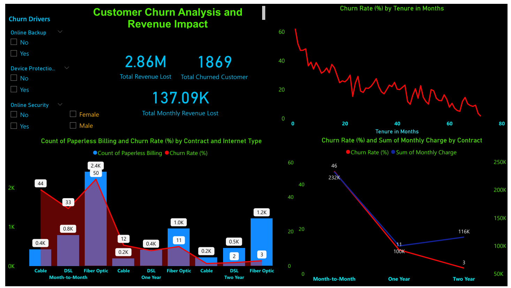
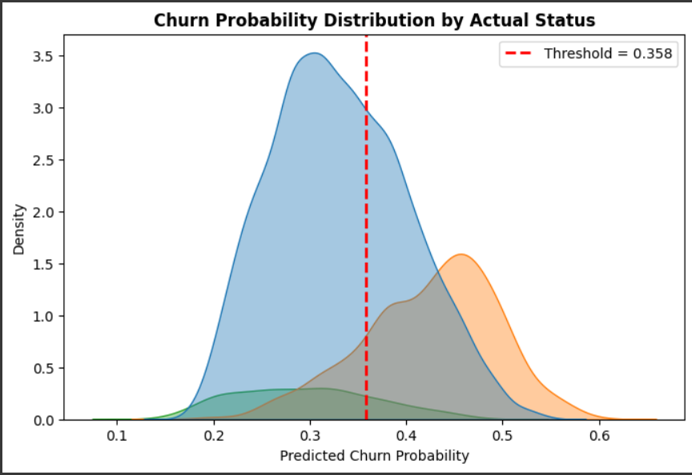
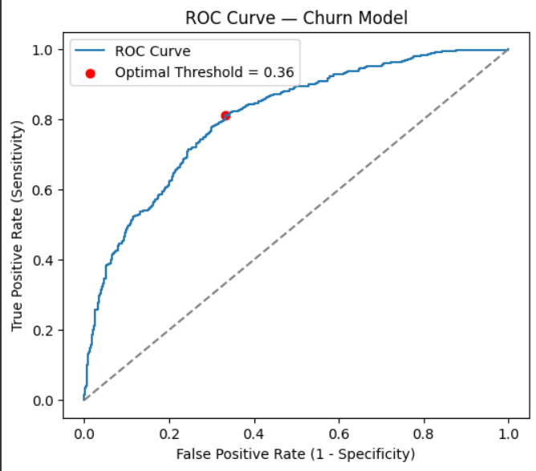

# 📘 Telecom Customer Churn Prediction — End-to-End Analysis (EDA + Machine Learning)

## 🧠 Project Overview

This project focuses on understanding and predicting **customer churn** in a telecom company using data analytics and machine learning techniques. The goal is to identify **key drivers of churn**, understand **customer behavior patterns**, and **predict high-risk customers** to help the business improve retention.

The project combines:

* 📊 **Exploratory Data Analysis (EDA)** for insights and trends
* 🤖 **Machine Learning (Random Forest Classifier)** for churn prediction
* 🎨 **Visualizations (Power BI + Python)** for business storytelling

---

## 🧾 Table of Contents

1. [Dataset Overview](#dataset-overview)
2. [EDA: Exploratory Data Analysis](#eda-exploratory-data-analysis)
3. [Power BI Dashboard](#power-bi-dashboard)
4. [Machine Learning Pipeline](#machine-learning-pipeline)
5. [Model Performance](#model-performance)
6. [Model Visualizations](#model-visualizations)
7. [Key Insights](#key-insights)
8. [Business Application](#business-application)
9. [Tools & Technologies](#tools--technologies)
10. [Project Files](#project-files)
11. [Conclusion](#conclusion)

---

## 📂 Dataset Overview

* **Dataset Name:** Telecom Customer Churn Dataset
* **Records:** ~7,000 customers
* **Target Variable:** `Customer Status` — {Stayed, Churned, Joined}
* **Objective:** Predict which customers are most likely to churn

**Key Features:**

* Demographics (Gender, Age, Dependents)
* Services (Internet Type, Security, Backup, Tech Support)
* Billing (Contract Type, Payment Method, Paperless Billing)
* Financials (Monthly Charges, Total Charges)
* Tenure (Months with the company)

---

## 🔍 EDA: Exploratory Data Analysis

### 🧹 Data Cleaning & Preparation

* Removed irrelevant columns: `Churn Reason`, `Churn Category`.
* Handled missing values — categorical: filled with **mode**, numeric: filled with **median**.
* Renamed columns and standardized column names.
* Created derived metrics: **Churn Rate**, **Total Revenue Lost**, **Monthly Revenue Lost**.

### 📊 Key Observations from EDA

1. **Churn Distribution:** About 26% of customers have churned.
2. **Contract Type:** Month-to-Month contracts show the highest churn (>40%).
3. **Tenure:** Churn rate decreases steadily with longer tenure.
4. **Internet Type:** Fiber optic users are more likely to churn than DSL users.
5. **Billing & Payment:** Paperless billing and electronic payment methods are linked to higher churn.

📸 **Power BI Dashboard Visualization:**



### 💰 Insights from Dashboard

* **Total Revenue Lost:** 2.86M
* **Total Churned Customers:** 1,869
* **Total Monthly Revenue Lost:** 137.09K
* Churn rate trends are shown by **Tenure**, **Contract Type**, and **Internet Type**.
* Dynamic slicers available for demographic and service-level analysis.

---

## 🤖 Machine Learning Pipeline

### ⚙️ Step 1: Data Preprocessing

| Step                     | Description                                                                      |
| ------------------------ | -------------------------------------------------------------------------------- |
| **1. Feature Encoding**  | Applied `pd.get_dummies()` for categorical variables                             |
| **2. Target Encoding**   | Used `LabelEncoder` on `Customer Status` → {Stayed, Churned, Joined} → {0, 1, 2} |
| **3. Scaling**           | Standardized numeric features using `StandardScaler`                             |
| **4. Balancing Classes** | Handled imbalance using `SMOTE`                                                  |
| **5. Train-Test Split**  | 80% train, 20% test with stratification                                          |

### 🧩 Step 2: Model Training

Trained multiple algorithms to compare performance:

* **Random Forest Classifier** *(Best Performer)*
* Logistic Regression
* Decision Tree
* Naive Bayes

#### Tuned Random Forest Configuration

```python
RandomForestClassifier(
    n_estimators=300,
    max_depth=15,
    min_samples_split=10,
    min_samples_leaf=5,
    class_weight='balanced',
    random_state=0
)
```

---

## 📈 Model Performance

| Metric                    | Before Tuning      | After Tuning |
| ------------------------- | ------------------ | ------------ |
| **Train Accuracy**        | 1.000 (Overfitted) | **0.863**    |
| **Test Accuracy**         | 0.833              | **0.803**    |
| **ROC-AUC (Multi-Class)** | 0.880              | **0.892**    |
| **Optimal Threshold**     | -                  | **0.358**    |

✅ **Interpretation:**

* Fine-tuning reduced overfitting while improving generalization.
* The model shows strong performance with **AUC = 0.892**, indicating excellent class separability.
* The optimal churn probability threshold (0.358) balances sensitivity and specificity.

---

## 📊 Model Visualizations

### 1️⃣ Churn Probability Distribution

Displays predicted churn probability for each customer class (Stayed, Churned, Joined). The vertical red line (0.358) marks the optimal threshold.

📸 **Probability Distribution Plot:**



### 2️⃣ ROC Curve — Random Forest Model

Demonstrates model performance with **AUC = 0.89**. The red point marks the optimal threshold (0.36).

📸 **ROC Curve Visualization:**



---

## 🔍 Key Insights from Machine Learning

- **Tenure**, **Monthly Charges**, and **Contract Type** are the top predictors of churn.
- Customers with **fiber-optic internet**, **paperless billing**, and **month-to-month contracts** have higher churn probabilities.
- **Auto-pay customers** are more loyal and less likely to leave.
- About **20–25%** of the customer base falls into the **high-risk churn** segment (probability ≥ 0.358).
- **Long-term contracts** (1-2 years) significantly improve retention
- **Tenure** and **total charges** are strong predictors of customer loyalty
- **Service bundling** (multiple lines, streaming) increases customer stickiness
- **High monthly charges** correlate with increased churn probability
---
### 🔹 Top 10 Most Important Features That Cause Churn

These features have the greatest influence on predicting customer churn and retention:


| Rank | Feature | Insight |
|------|----------|----------|
| 1️⃣ | Total Charges | High spenders tend to stay |
| 2️⃣ | Total Revenue | Correlates with customer value |
| 3️⃣ | Tenure in Months | Short tenure → higher churn |
| 4️⃣ | Total Long Distance Charges | Reflects engagement |
| 5️⃣ | Contract (Two Year) | Long contracts reduce churn |
| 6️⃣ | Monthly Charge | High bills drive churn |
| 7️⃣ | Contract (One Year) | Improves retention |
| 8️⃣ | Multiple Lines | More services → higher retention |
| 9️⃣ | Married | Married customers churn less |
| 🔟 | Streaming TV | Bundled services increase loyalty |

-------
## 🧭 Business Application

| Segment         | Probability Range | Action Plan                                         |
| --------------- | ----------------- | --------------------------------------------------- |
| **High Risk**   | ≥ 0.36            | Immediate retention offers & personalized follow-up |
| **Medium Risk** | 0.25 – 0.36       | Improve service, strengthen loyalty programs        |
| **Safe**        | < 0.25            | Continue engagement through routine campaigns       |

* **Deploy model monthly** to predict churn trends.
* Integrate predictions into **Power BI dashboards** for real-time insights.
* Enable marketing and customer success teams to focus on high-value retention.

---

## 🧰 Tools & Technologies

| Category                | Tools Used                             |
| ----------------------- | -------------------------------------- |
| **EDA & Data Cleaning** | Python (Pandas, NumPy)                 |
| **Visualization**       | Matplotlib, Seaborn, Power BI          |
| **Modeling**            | scikit-learn, imbalanced-learn (SMOTE) |
| **Deployment**          | Power BI, Excel, Pickle (.pkl model)   |

---

## 📁 Project Files

| File Name                               | Description                               |
| --------------------------------------- | ----------------------------------------- |
| `Teleco_Chustomer_Churn_Analysis.ipynb` | Google Colab Notebook containing EDA & ML code |
| `teleco_churn_data.xlsx`                |  dataset                           |
| `POWER_BI_DASHBOARD.png`                | Power BI visualization screenshot         |
| `Probability_distribution.png`          | Churn probability density plot            |
| `ROC_Curve.png`                         | ROC curve for tuned Random Forest model   |
| `README.md`                             | Documentation file                        |

---

## 🧾 Conclusion

✅ **Final Model:** Random Forest Classifier
✅ **Test Accuracy:** 80.3%
✅ **AUC:** 0.892
✅ **Optimal Threshold:** 0.358

The model successfully predicts customer churn probability and provides actionable business insights.
When integrated with Power BI dashboards, it delivers a complete **data-to-decision solution** for customer retention.
This end-to-end Telecom Customer Churn Analysis project demonstrates how EDA and Machine Learning can predict churn and identify the key drivers of customer retention.

By acting on churn predictions and customer insights, telecom companies can:
- Reduce churn by 20–30%
- Increase customer lifetime value
- Optimize marketing and retention strategies

---

**Author:** Sourav Mondal, Email: souravmondal5f@gamil.com 
**Tools:** Python | Power BI | Excel | SQL
**Keywords:** Telecom, Churn Prediction, Machine Learning, Data Visualization, Customer Retention
